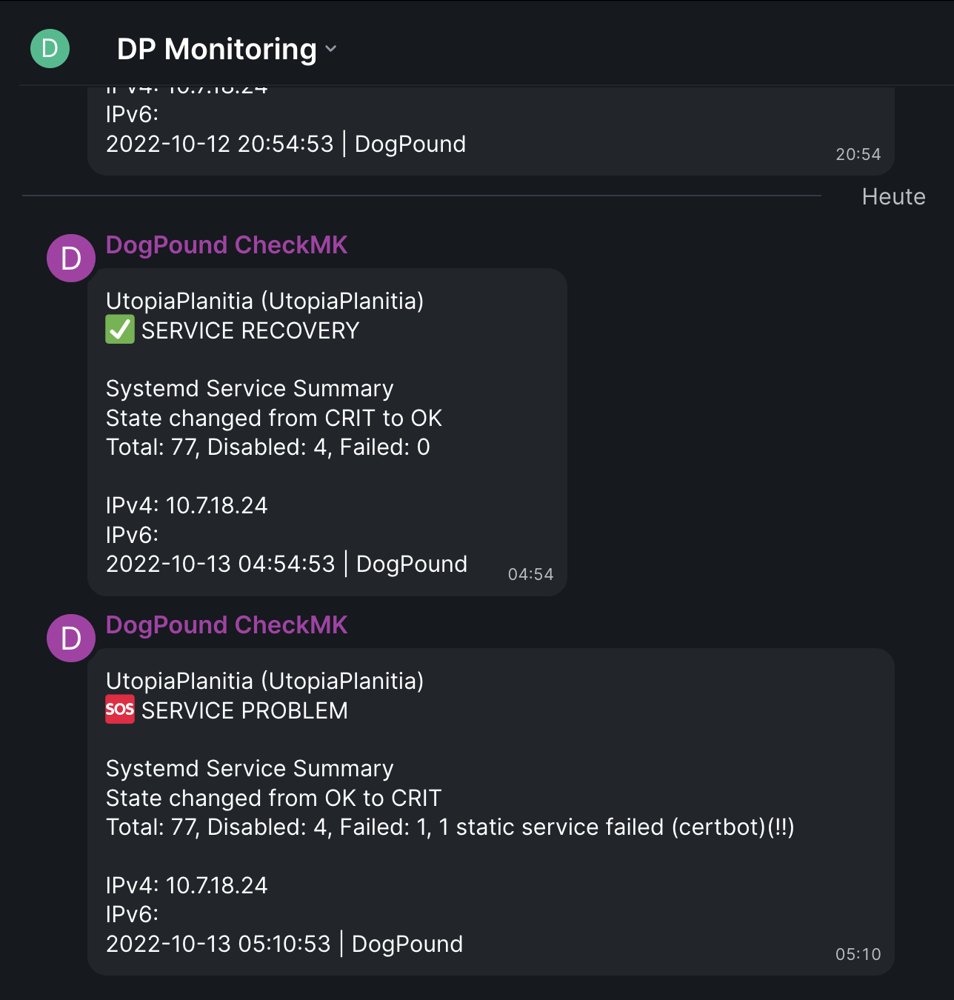
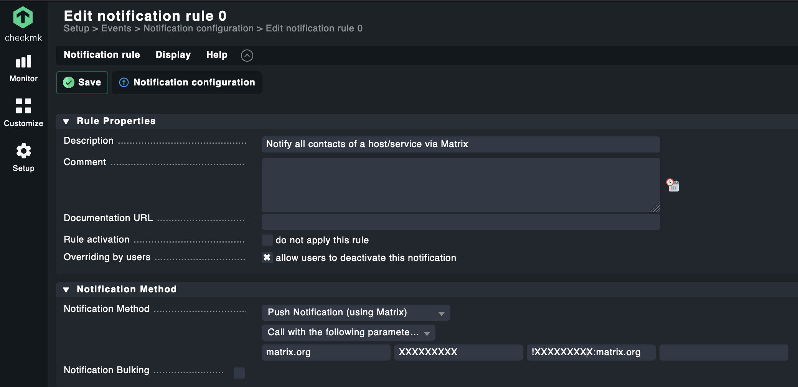
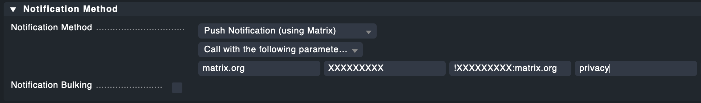

# Check_MK Matrix notification

Forked the great check-telegram-notify from filipnet and change it to use the Matrix Network instand of Telegram.


<!-- TOC -->

- [Check_MK Matrix notification](#check_mk-matrix-notification)
    - [COMPATIBILITY](#compatibility)
    - [EXAMPLE](#example)
    - [REQUIREMENTS](#requirements)
    - [INSTALLATION](#installation)
    - [CHECK_MK CONFIGURATION](#check_mk-configuration)
        - [CHECK_MK VERSION 2.0.0 AND ABOVE](#check_mk-version-200-and-above)
        - [ACTIVATE CHANGES](#activate-changes)
        - [PRIVACY ANONYMIZATION / MASQUERADING](#privacy-anonymization--masquerading)
    - [TROUBLESHOOTING](#troubleshooting)
    - [CONTRIBUTIONS](#contributions)
    - [LICENSE](#license)

<!-- /TOC -->

## COMPATIBILITY
- Check_MK RAW version 1.6.0_p18 
- Check_MK RAW version 2.0.0_p8
- Should also work with other versions of Check_MK

## EXAMPLE
Notifications are usually sent via a Matrix group. Here is an example of how a Matrix notification is structured.



## REQUIREMENTS
In order for Check_MK to send alerts (notifications) to the Matrix Messenger, we need

* a Matrix User and his user Token
* a Room ID

There are a lot of good instructions for this on the Internet, so this is not part of this documentation.

## INSTALLATION
Change to your Check_MK site user
```
su - mysite
```

Change to the notification directory
```
cd ~/local/share/check_mk/notifications/
```

Download the Telegram notify script from Git repository
```
wget https://raw.githubusercontent.com/Hagbear/checkmk-matrix-notify/main/check_mk_matrix-notify.sh
```

Give the script execution permissions
```
chmod +x check_mk_matrix-notify.sh
```

## CHECK_MK CONFIGURATION
### CHECK_MK VERSION 2.0.0 AND ABOVE
Now you can create your own alarm rules in Check_MK.

```Setup → Events → Notifications```

First create a clone of your existing mail notification rule


* Change the description (e.g. Notify all contacts of a host/service via Matrix)
* The notification method is "Push Notification (by Matrix)"
* Select option "Call with the following parameters:"
* As the first parameter we set the Matrix Homeserver URL (without https://)
* The second parameter is the Matrix UserToken
* The third parameter is the Matrix RoomID 




If everything was ok, you will see your new Notification Rule afterwards


### ACTIVATE CHANGES

Since Check_MK 2.0.0 it is calles "Active on selected sites"


To ensure that the parameters are also transferred in the event of an alert, it is strongly recommended that the Check_MK instance is restarted.
```
su - mysite
omd stop
omd start
```

### PRIVACY ANONYMIZATION / MASQUERADING
The current version of this script allows you to optionally enable IP anonymization. This gives you the option to comply with your own privacy policy or the recommendations of data protection authorities in certain countries if they prohibit the transmission of the full IP address. This masks IPv4 and IPv6 IP addresses before they are transmitted in a message to the Matrix service.

The activation of the privacy settings is realized directly in the Notification Rules in Check_MK by NOTIFY_PARAMETER_4, here the value "privacy" has to be entered:



There are certainly different requirements for privacy and masquerading of IP addresses. In the script, the IPv4 IP address is split into the 4 octets, the IPv6 address into the 8 columns. This allows to control __very individually__ which parts of the addresses are sent via Matrix and which are not. Both, placeholders and manipulations are basically possible here. 

The adjustment is done exclusively in the following two lines of the script.
```
# Adjust the output to your privacy needs here (Details in the readme.md)
NOTIFY_HOST_ADDRESS_4="${sec1}.${sec2}.2.${sec4}"
NOTIFY_HOST_ADDRESS_6="${sec1}:${sec2}:${sec3}:${sec4}:ffff:ffff:ffff:${sec8}"
```

Explanation for the example configuration above:
* 192.168.__143__.104 --> 192.168.__2__.104
* 2001:db8:85a3:8d3:__1319__:__8a2e__:__370__:7348 --> 2001:db8:85a3:8d3:__ffff__:__ffff__:__ffff__:7348


## TROUBLESHOOTING
For more details and troubleshooting with parameters please check:
* Check_MK notification logfile: /omd/sites/{sitename}/var/log/notify.log
* [Check_MK  Manual > Notifications > Chapter: 11.3. A simple example](https://docs.checkmk.com/latest/en/notifications.html#H1:Real)
* [[Feature-Request] Multiple Alert Profiles](https://github.com/Hagbear/checkmk-matrix-notify/issues/3)

## CONTRIBUTIONS
* First [filipnet](https://github.com/filipnet) for the orginal code. 
* Thank you for the excellent code optimization contributions and additional information [ThomasKaiser](https://github.com/ThomasKaiser).
* Best regards to [Jonathan Barratt](https://github.com/reduxionist) in Bangkok and many thanks for adding emojies to the module.

## LICENSE
checkmk-matrix-notify and all individual scripts are under the BSD 3-Clause license unless explicitly noted otherwise. Please refer to the LICENSE
